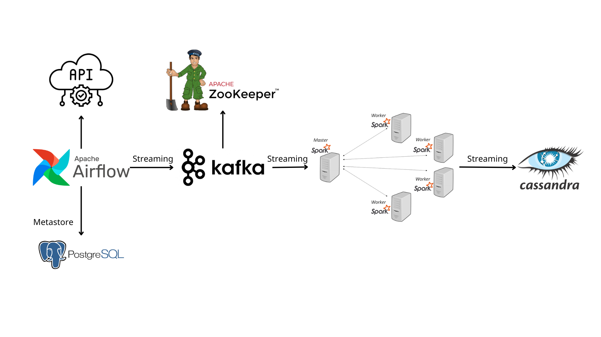

# ETL Realtime Streaming

Building a real-time data streaming pipeline with Apache Airflow, Apache Kafka, Apache Spark, Cassandra - all neatly containerized using Docker

## System Architecture



Describe each components:

- Data Source: Using `randomuser.me` API to generate random user data for pipeline

- Apache Airflow: The execution function sends the user's information to Apache Kafka
- Apache Kafka and Zookeeper: Streaming from Airflow to the processing engine
- Apache Spark: Processing data from Apache Kafka with its master and workers nodes
- Cassandra: NoSQL database, where the processed data will be stored

## Setup

1. Build extends docker Airflow by adding more packages

```bash
make build-airflow
```

2. Run all services with Docker Compose

```bash
docker compose up -d
```

3. Trigger Airflow DAG to send data to Kafka
4. Run Spark job to get data from Kafka and stream it to Cassandra

```bash
make run-spark
```
